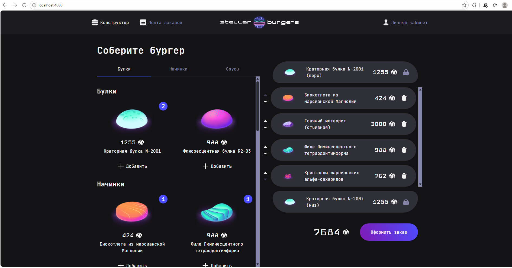

# Stellar Burgers 🍔🪐

**Stellar Burgers** — это интерактивное одностраничное веб-приложение (SPA) для «космической бургерной». Проект включает в себя динамический конструктор бургеров, полноценную систему авторизации пользователей, личный кабинет и интеграцию с сервером заказов. 

Разработано в рамках учебной программы Яндекс Практикум.


---

## 🛠 Стек технологий

* **Frontend:** React, TypeScript, Redux Toolkit, React Router v6
* **Сборка и линтинг:** Webpack, ESLint, Prettier
* **Компоненты:** Storybook
* **Тестирование:** Jest (Unit), Cypress (E2E)
* **Интерфейс & API:** REST API, CSS Modules / библиотека компонентов Практикума

---

## 🚀 Реализованный функционал и этапы работы

В ходе разработки приложения были успешно выполнены следующие этапы и инженерные задачи:

1. **Исследование кодовой базы:** Ознакомилась с исходной структурой проекта, адаптировала и «оживила» готовую структуру компонентов, связав их внутреннее состояние с данными сервера.
2. **Маршрутизация и навигация:** Настроила роутинг (React Router), включая защищённые маршруты (Protected Routes) для личного кабинета, динамические пути для карточек ингредиентов и заказов, а также обработку несуществующих страниц (404).
3. **Управление состоянием и API:** Реализовала глобальное состояние приложения на Redux Toolkit. Интегрировала асинхронное взаимодействие с API через `createAsyncThunk` (используя эндпоинты в `utils/burger-api.ts`) для управления состоянием конструктора, профиля и истории заказов.
4. **Авторизация и безопасность:** Добавила регистрацию, вход, защиту личного кабинета, восстановление пароля и безопасное редактирование профиля с валидацией форм.
5. **Качество кода и тестирование:** Написала Unit-тесты на Jest (для проверки редьюсеров и экшенов) и E2E-тесты на Cypress для ключевых пользовательских сценариев, включая процесс сборки бургера и оформления заказа.
6. **Строгая типизация:** Использовала TypeScript для строгой типизации данных приложения, что позволило выстроить предсказуемую структуру проекта и исключить ошибки на этапе компиляции.
7. **Инфраструктура кода:** Интегрировала инструмент Storybook для изолированной разработки компонентов, а также настроила ESLint и Prettier для поддержания единого стиля кода.

---

## 📂 Структура проекта

```text
src/
├── components/   # Переиспользуемые UI-компоненты (модалки, конструктор, формы)
├── images/       # Статические изображения и графические ассеты
├── pages/        # Компоненты страниц (Главная, Логин, Профиль, 404 и др.)
├── services/     # Логика Redux Toolkit (slices, thunks, store)
├── stories/      # UI-компоненты и истории для Storybook
├── utils/        # Вспомогательные функции, типы TypeScript и конфигурация API
├── index.css     # Глобальные стили приложения
├── index.tsx     # Точка входа в React-приложение
├── styles.d.ts   # Декларация типов для CSS-модулей
└── svg.d.ts      # Декларация типов для SVG-файлов
```

---

## ⚙️ Инструкция по локальному запуску

Для запуска проекта на локальном компьютере выполните следующие команды:

```bash
# 1. Клонируйте репозиторий
git clone https://github.com

# 2. Перейдите в директорию проекта
cd stellar-burgers

# 3. Установите зависимости
npm install

# 4. Настройте переменные окружения
# Создайте файл .env в корне проекта и добавьте туда переменную BURGER_API_URL.
# Пример настройки и актуальную ссылку можно найти в файле .env.example.

# 5. Запустите проект в режиме разработки (Webpack Dev Server)
npm run start
```

---

## 🛠 Дополнительные скрипты разработки

* `npm run lint` / `npm run lint:fix` — проверка и автоисправление ошибок стиля (ESLint).
* `npm run format` — форматирование кода (Prettier).
* `npm run storybook` — запуск локального сервера Storybook (на порту 6006).

---

## 🧪 Тестирование

* **Unit-тесты (Jest):** 
  * `npm run test` — одиночный запуск тестов.
  * `npm run test:watch` — запуск в режиме отслеживания изменений.
  * `npm run test:coverage` — генерация отчета о покрытии кода тестами.
* **E2E-тесты (Cypress):** 
  * `npm run cypress:open` — открыть графический интерфейс Cypress.
  * `npm run cypress:run` — запустить тесты в консольном (headless) режиме.
